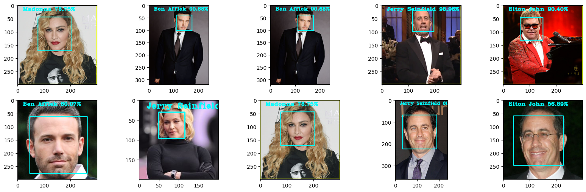

# Face Recognition Project

This project implements a face recognition system using OpenCV and the LBPH (Local Binary Pattern Histogram) Face Recognizer. It can detect faces in images and predict the identity of the person based on trained data.

## Features

- Face detection using Haar Cascade Classifier
- Face recognition using LBPH Face Recognizer
- Training on multiple people
- Prediction with confidence scores
- Visualization of results

## Prerequisites

```
- Python 3.x
- OpenCV (cv2)
- NumPy
- Matplotlib (for visualization)
```

## Project Structure

```
project/
│
├── faces/
│   ├── train/     # Training images organized by person
│   └── val/       # Validation images organized by person
│
├── haarcascade_frontalface_default.xml  # Haar Cascade classifier
├── face_recognizer.yml                  # Trained model
├── face_recognizer_features.npy         # Saved features
└── face_recognizer_labels.npy           # Saved labels
```

## How It Works

1. **Data Preparation**
   - Images should be organized in folders by person
   - The system reads these images and extracts facial features

2. **Training**
   - Detects faces in training images
   - Extracts features using LBPH
   - Trains the face recognizer
   - Saves the model and features

3. **Prediction**
   - Loads the trained model
   - Detects faces in new images
   - Predicts identity and confidence score
   - Visualizes results with bounding boxes and labels

## Usage

### Training

```python
# Load training data
features = []
labels = []
haar_cascade = cv.CascadeClassifier('haarcascade_frontalface_default.xml')

# Extract features and labels
for person in people:
    path = os.path.join('faces/train', person)
    for im in os.listdir(path):
        # Process each image...

# Train the recognizer
face_recognizer = cv.face.LBPHFaceRecognizer_create()
face_recognizer.train(features, labels)

# Save the model
face_recognizer.save('face_recognizer.yml')
```

## Visualization

The project includes functionality to visualize predictions:
- Draws bounding boxes around detected faces
- Labels each face with predicted identity and confidence score
- Can display multiple predictions using matplotlib



## Notes

- Accuracy depends on the quality and quantity of training data
- Lighting and face angle can affect recognition accuracy
- The system performs best with consistent image conditions

## Future Improvements

- Implement real-time face recognition using webcam
- Add data augmentation for better training
- Implement a GUI for easier use
- Add support for multiple face recognition models